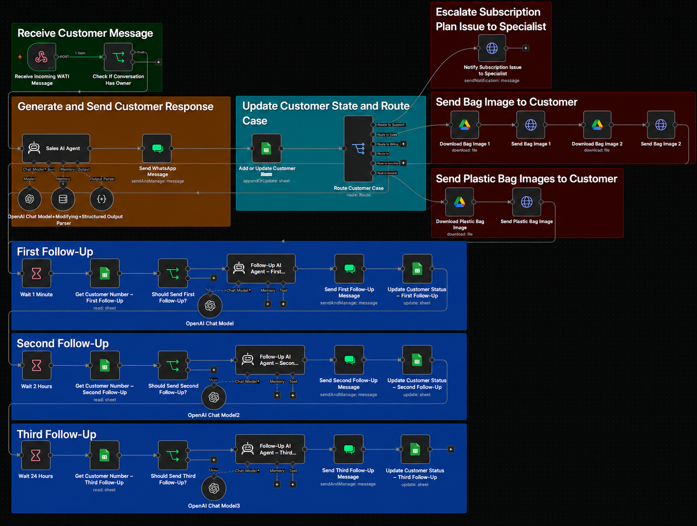
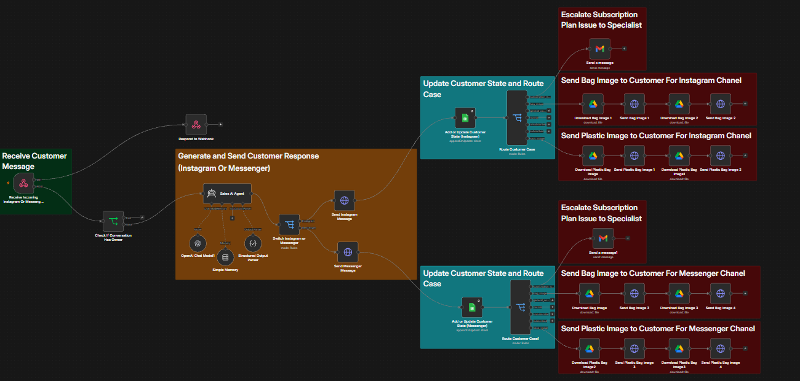

# 🤖 Multi-Channel AI Sales Agent

An end-to-end AI-powered sales automation system built with **n8n**, designed to handle customer conversations, qualify leads, recommend suitable offers, manage sales objections, and move customers toward conversion across multiple messaging channels.

The system operates across:

- 💬 WhatsApp through WATI
- 📸 Instagram
- 💬 Facebook Messenger

It combines AI sales conversations, customer state tracking, channel routing, subscription validation, automated follow-ups, media delivery, and escalation logic into one multi-channel sales architecture.

---

## 🚀 Project Overview

This project was built to automate more than simple sales replies.

The AI Agent acts as a digital sales representative that understands customer intent, identifies the customer's needs, recommends the most suitable offer, answers questions, handles objections, and guides the conversation toward subscription.

Two separate n8n workflows were built for the different communication environments:

1. **WhatsApp Sales Agent** integrated through WATI
2. **Instagram & Messenger Sales Agent** integrated directly with Meta messaging APIs

---

## ✨ Key Features

- 🤖 AI-powered sales conversations
- 🎯 Customer need qualification
- 💡 Personalized plan recommendations
- 💬 Objection handling
- 🔀 Intent-based customer routing
- 🧠 Conversation memory and context
- 📊 Customer state tracking
- 🖼️ Dynamic media and product-image delivery
- 🔗 API integrations
- 📩 Subscription-issue escalation
- ✅ Subscription-state detection
- 🚫 Unsubscribe and conversion-state handling
- 📱 Multi-channel sales architecture

---

## 💬 WhatsApp Sales Agent — WATI

The WhatsApp workflow handles incoming sales conversations through **WATI** and uses an AI Agent to manage the customer journey.

The workflow can:

- Receive and process incoming WhatsApp messages
- Maintain conversation context
- Generate personalized sales responses
- Route customers based on their current intent
- Handle normal sales conversations
- Detect subscription-related issues
- Detect completed subscriptions
- Handle unsubscribe requests
- Send relevant product/media assets
- Store and update customer conversation state

### 🔁 Intelligent Sales Follow-Up

One of the main components of the WhatsApp workflow is its automated follow-up system.

If a potential customer does not complete the subscription, the system can automatically continue the sales journey using multiple AI-generated follow-ups.

The follow-up lifecycle includes:

```text
Customer Conversation
        ↓
AI Sales Response
        ↓
Customer State Tracking
        ↓
Check Subscription Status
        ↓
Still Not Subscribed?
        ↓
First AI Follow-Up
        ↓
Check Subscription Again
        ↓
Second AI Follow-Up
        ↓
Check Subscription Again
        ↓
Third AI Follow-Up
```

Before continuing the follow-up sequence, the workflow checks whether the customer already has an active subscription.

If the customer has already subscribed, the sales follow-up process is stopped.

This prevents unnecessary follow-up messages and keeps the automation aligned with the customer's current conversion state.

---

## 📸 Instagram & Messenger Sales Agent

The second workflow connects the AI Sales Agent directly with **Instagram and Facebook Messenger**.

Incoming Meta messages are processed through n8n and routed to the same AI-driven sales logic.

The workflow supports:

- Instagram conversations
- Facebook Messenger conversations
- AI-generated sales replies
- Channel-specific message delivery
- Conversation-state tracking
- Customer intent classification
- Subscription issue routing
- Conversion detection
- Unsubscribe handling
- Dynamic image delivery
- Customer-state persistence

The system determines the active communication channel and sends the AI response through the correct Meta messaging endpoint.

---

## 🧠 AI Sales Logic

The AI Agent is designed to behave as a sales representative rather than a basic FAQ bot.

Its responsibilities include:

```text
Understand Customer
        ↓
Identify Need
        ↓
Qualify Intent
        ↓
Recommend Best Option
        ↓
Explain Value
        ↓
Handle Objection
        ↓
Guide Toward Conversion
```

The Agent can also classify special customer situations and route them into dedicated automation paths instead of treating every message as a normal sales conversation.

---

## 🏗️ System Architecture

```text
                     ┌─────────────────────┐
                     │   AI Sales Logic    │
                     └─────────┬───────────┘
                               │
                  ┌────────────┴────────────┐
                  │                         │
          WhatsApp / WATI          Instagram / Messenger
                  │                         │
                  ▼                         ▼
             n8n Workflow              n8n Workflow
                  │                         │
                  ├── AI Agent              ├── AI Agent
                  ├── Memory                ├── Memory
                  ├── Customer State        ├── Customer State
                  ├── Media Delivery        ├── Meta Routing
                  ├── Subscription Check    ├── Media Delivery
                  └── AI Follow-Ups         └── Case Routing
```

---

## 🖼️ Workflow Screenshots

### WhatsApp / WATI AI Sales Workflow



This workflow contains the WhatsApp AI Sales Agent, customer routing, subscription-state validation, customer-state tracking, media delivery, and automated multi-stage sales follow-ups.

### Instagram & Messenger AI Sales Workflow



This workflow handles AI-powered sales conversations across Instagram and Facebook Messenger with direct Meta messaging integration and channel-aware routing.

---

## 🛠️ Tech Stack

**AI**

- OpenAI
- AI Agents
- Conversation Memory
- Structured AI Outputs

**Automation**

- n8n
- Webhooks
- REST APIs

**Communication Channels**

- WATI
- WhatsApp
- Instagram
- Facebook Messenger
- Meta Messaging APIs

**Data & Integrations**

- Google Sheets
- Google Drive
- Subscription Status API
- Gmail Notifications

---

## 📂 Repository Structure

```text
ai-sales-agent/
│
├── README.md
├── whatsapp-wati-sales.json
├── instagram-messenger-sales.json
├── whatsapp-wati-sales-agent-workflow.png
└── instagram-messenger-sales-agent-workflow.png
```

### `whatsapp-wati-sales.json`

WhatsApp sales automation including AI conversations, customer routing, subscription-state checks, automated follow-ups, media handling, and customer-state management.

### `instagram-messenger-sales.json`

Meta sales automation responsible for AI conversations across Instagram and Messenger, channel routing, customer-state management, media delivery, and sales-case classification.

---

## 🔐 Security & Privacy

This repository contains sanitized portfolio versions of the production workflows.

For security and confidentiality:

- API keys and tokens were removed
- Credentials were replaced with placeholders
- Production endpoints were anonymized
- Customer information was removed
- Private identifiers were removed
- Internal business prompts and proprietary sales rules were simplified

The public workflows demonstrate the **architecture, automation design, AI integration, and sales orchestration approach** without exposing production secrets or confidential business information.

---

## 🎯 Project Goal

The goal was to build an AI sales system capable of managing the complete conversational sales journey across multiple channels:

**Engage → Understand → Qualify → Recommend → Handle Objections → Follow Up → Convert**

---

### Built by Yahya Zakaria

**AI Specialist | AI Agents | n8n Automation | Machine Learning**
